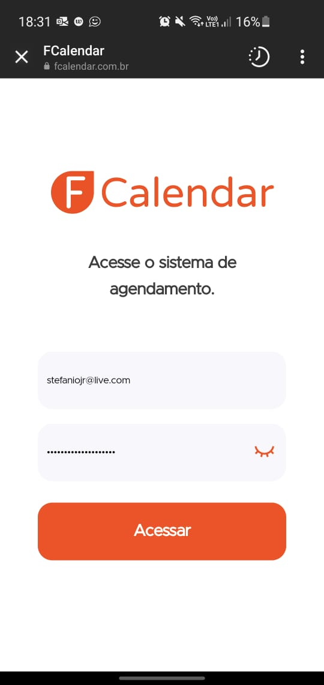
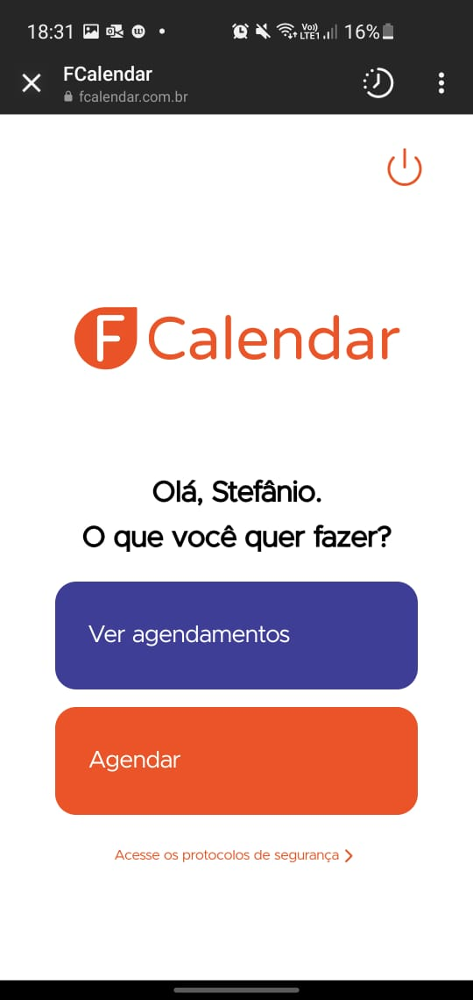
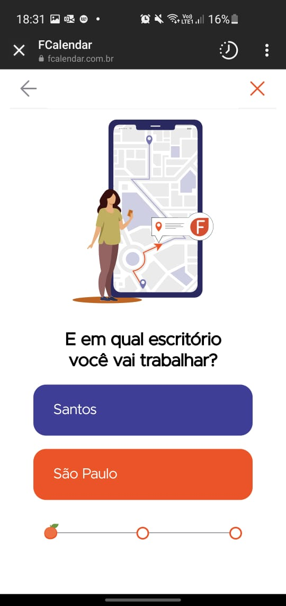
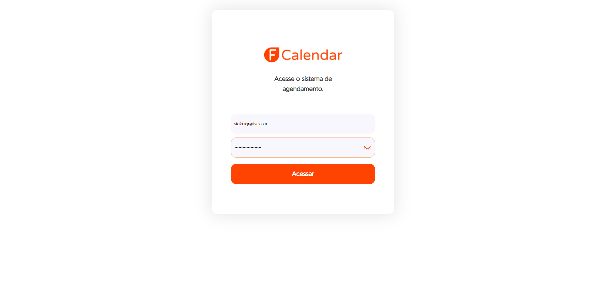
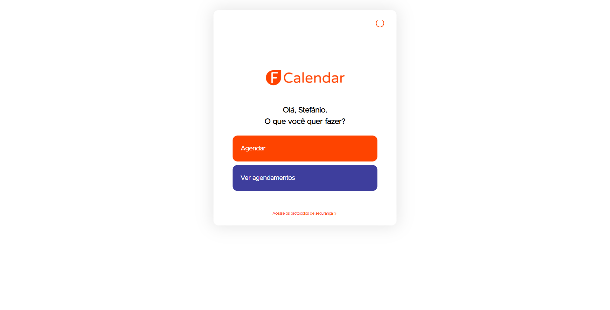
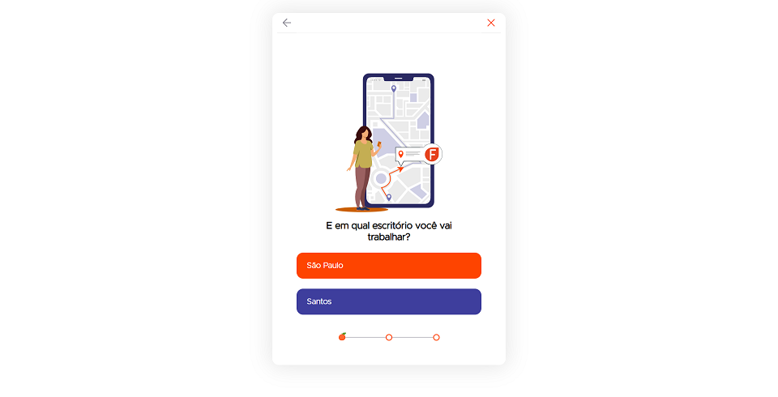

<h1 align="center">
     
</h1>

   
   
   
   
   

<h4 align="center" > 
  🍊 <a href="https://fcalendar.com.br/" target="_blank">FCalendar</a> 📅
</h4>

 <a href="#%EF%B8%8F-sobre">Sobre</a> •
 <a href="#-o-que-dá-pra-fazer">O que dá pra fazer?</a> •
 <a href="#-na-prática">Na prática</a> • 
 <a href="#-setup-do-projeto-front-end">Setup do projeto Front End</a> • 
 <a href="#%EF%B8%8F-como-subir">Subindo localmente</a> • 
 <a href="#-que-legal-como-contribuir">Que legal! Como contribuir?</a> • 
 <a href="#-carinhosamente-feito-por">Carinhosamente feito por</a>

## 🖊️ Sobre
FCalendar é o sistema de agendamentos desenvolvido pelo Squad 23 no Hackaton 2021 Season 2 da FCamara em seu processo seletivo do programa de formação. A aplicação, desenvolvida na stack Angular+PHP, é um meio rápido, fácil e prático dos funcionários da FCamara (#SangueLaranja) programarem sua ida ao escritório, quando convir. Além disso, os #SangueLaranja podem enviar convites através de um sistema de convites via e-mail. Legal, né?

<a href="https://github.com/NatanMenezes/api_agendamento_squad23" target="_blank">Clique aqui para acessar a aplicação Back End</a>

## 🤔 O que dá pra fazer?
- Agendar sua ida ao escritório;
- Ver o número de pessoas confirmadas em cada turno;
- Convidar colegas para ir com você com um sistema de convite via e-mail;
- Checar e cancelar agendamentos.

## 🏋🏽 Na prática
Para realizar um agendamento é bem simples! Basta logar na sua conta previamente cadastrada por um administrador. Criamos usuários de teste para que você possa testar o sistema, fique à vontade para utilizar qualquer um deles:

`{ "email": "marimendanha.fcamara@gmail.com", "senha": "fcalendar" }`

`{ "email": "samurodrigues.fcamara@gmail.com", "senha": "fcalendar" }`

Ambos os usuários possuem conta no gmail com mesma senha! Dica: logue em um no sistema FCalendar e outro no gmail e envie um convite para ele para ver a mágica acontecendo!

Você também poderá realizar agendamentos, convidar amigos, checar agendamentos realizados e excluir algum deles. Todas essas visões estão bem adaptadas para navegadores web ou mobile.
### Mobile

### Web

<a href="https://www.youtube.com/watch?v=nJJgadxlk1U" target="_blank">Clique aqui para acessar o tutorial em vídeo</a>

## 🛠 Setup do projeto Front End
- Angular CLI: 12.2.4
- Node: 14.17.0
- Angular: 12.2.4

## ⬆️ Como subir?

### Localmente
- Clone o repositório em sua máquina;
- Instale as dependências usando o comando `npm install`;
- Na raiz do repositório, rode o comando `ng serve` para iniciar o servidor de desenvolvimento;
- A aplicação estará disponível na porta `http://localhost:4200/`.
- Não se preocupe com a aplicação Back End! Já estamos apontando para o link dela na web. Entretanto, caso queira testar com o Back End local vá até `src/app/services/api.service.ts` e altere a variável `baseURL` no método `buildURL()` para a URL local.

### Estamos na Web!
Quer praticidade? Nós temos! FCalendar está disponível integramente no endereço abaixo:

https://fcalendar.com.br/

Gostou?

## 🚀 Que legal! Como contribuir?
Acha que algo pode ser melhorado de alguma forma? Quer implementar uma nova funcionalidade? Nos ajude! Mas só depois de sermos avaliados, beleza? Até lá, trazemos informações importantes sobre como colaborar com esse projeto:
- Fork nosso repositório;
- Agora, clone o seu repositório em sua máquina;
- Crie uma branch com seu nome espaçada por hífens e lowercase, por exemplo, Stefânio Junior ficaria stefanio-junior;
- Commite bem suas alterações e faça pushs periódicos para que possamos acompanhar o seu processo;
- Crie uma Pull Request.

## 🧡💻 Carinhosamente feito por

<table>
  <tr>
    <td align="center"><a href="https://github.com/anagabatteli"> <b>Ana Gabatteli</b></a> <a href="https://www.linkedin.com/in/anagabatteli/" title="L‍inkedin">L‍inkedin</a>
<i>UX Designer</i>
</td>
    <td align="center"><a href="https://github.com/kintupla"> <b>Matheus Honorato</b></a> <a href="https://www.linkedin.com/in/matheus-honorato-43533693/" title="L‍inkedin">L‍inkedin</a>
<i>Back End Developer</i>
</td>
    <td align="center"><a href="https://github.com/NatanMenezes"> <b>Natã Menezes</b></a> <a href="https://www.linkedin.com/in/natanmenezes31/" title="L‍inkedin">L‍inkedin</a>
<i>Back End Developer</i>
</td>
    <td align="center"><a href="https://github.com/stefaniojr"> <b>Stefânio Junior</b></a> <a href="https://www.linkedin.com/in/stefaniojr/" title="L‍inkedin">L‍inkedin</a>
<i>Front End Developer</i>
</td>
  </tr>
</table>
